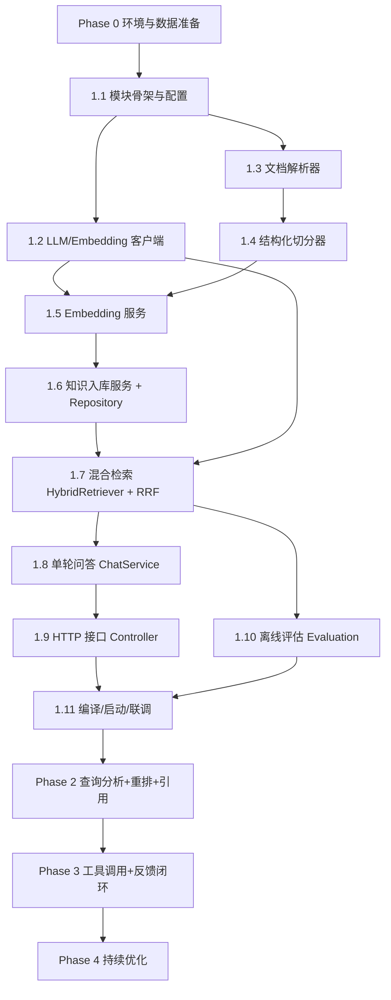

# AI 智能客服 · 开发顺序文档（Dev Order）

> 版本：v1.0（2026-08-07）
> 依据：`docs/ai-customer-service-rag-v2.md`（方案 v2.1 + 决策记录 v2.2）
> 目标：给出一份可执行、有依赖顺序、有验收标准的开发路线，避免“先写代码再补评估”的返工。

---

## 0. 已确认的决策（不再讨论）

| 项 | 决策 |
|---|---|
| 会话形态 | 首版**单轮问答**，无多轮上下文；sessionId 仅用于日志 |
| 模型 | **云端 API**（DashScope / OpenAI 兼容）；Embedding=text-embedding-v3，Chat=qwen-plus |
| 知识语料 | 暂无真实语料，使用**模拟语料** `knowledge/`（含 front matter 元数据） |
| 转人工 | 返回固定文案 **“人工处理中...”**，不创建工单 |
| 检索 | 向量 + BM25 混合召回 + RRF 融合；重排二期 |
| 评估 | Golden 30 条（`docs/ai-eval/golden-qa.md`）先行；Top-5 命中率 ≥ 60%（Phase 1 基线） |
| 反馈 | 首版就做（点赞/点踩/转人工上报） |
| 部署 | PostgreSQL 12+（vector 扩展）；BM25 用 PG tsvector（中文空格分词方案，不依赖 zhparser） |
| 框架 | Java 17 + Spring Boot 2.7；**RAG 编排自研**，LLM/Embedding 用 OpenAI 兼容 HTTP 客户端 |

---

## 1. 当前进展（截至 2026-08-07）

| 状态 | 内容 |
|---|---|
| ✅ 已完成 | 方案文档 v2.1/v2.2（含决策记录、待澄清清单） |
| ✅ 已完成 | 模拟知识语料 `knowledge/`（10 个文件，退款/商品/拼团/FAQ） |
| ✅ 已完成 | Golden 测试集 `docs/ai-eval/golden-qa.md`（30 条） |
| ✅ 已完成 | `group-buy-market-xk-ai` 模块注册：根 pom 已加 module、ai/pom.xml 已建、app/pom.xml 已加依赖 |
| ✅ 已完成 | `docs/dev-ops/pgsql/ai_knowledge.sql`（DDL） |
| ✅ 已完成 | `application-dev.yml` 追加 `ai.*` 配置块 |
| ⏳ 未开始 | AI 模块 Java 代码（解析/切分/Embedding/入库/检索/问答/评估/接口） |

---

## 2. 开发顺序总览



| 阶段 | 主题 | 周期 | 退出标准 |
|---|---|---|---|
| Phase 0 | 环境与数据准备 | 1-2 天 | PG 可用、DDL 执行成功、API Key 就绪、语料就位 |
| Phase 1 | RAG 最小闭环（入库→检索→问答→评估） | 1-2 周 | Top-5 命中率 ≥ 60%，接口可联调 |
| Phase 2 | 查询分析 + 重排 + 引用 + 反馈闭环 | 1-2 周 | Top-5 命中率 ≥ 80%，转人工率下降 |
| Phase 3 | 工具调用（订单/退款状态）+ 未命中聚类 | 1-2 周 | 状态类问题可答，评估一键回归 |
| Phase 4 | 持续优化（A/B、知识更新、成本） | 持续 | 满意度提升、成本可控 |

---

## 3. Phase 0 · 环境与数据准备

| # | 任务 | 说明 | 验收 |
|---|---|---|---|
| 0.1 | 确认 JDK17 | 本机 `D:\JDK`（17.0.19） | `java -version` 输出 17 |
| 0.2 | 确认 Maven | IntelliJ 自带：`D:\IntelliJ IDEA 2026.1.4\plugins\maven\lib\maven3\bin\mvn.cmd` | `mvn -version` 可执行 |
| 0.3 | 准备 PostgreSQL | 建议独立库 `group_buy_market_ai`；版本 ≥ 12，启用 `vector` 扩展 | 可连接、可建表 |
| 0.4 | 执行 DDL | `docs/dev-ops/pgsql/ai_knowledge.sql` | 4 张表 + 索引创建成功 |
| 0.5 | 申请云端 API Key | DashScope（或任意 OpenAI 兼容服务） | 有 base-url / api-key / 模型名 |
| 0.6 | 配置环境变量 | `AI_DB_URL`、`AI_DB_USERNAME`、`AI_DB_PASSWORD`、`AI_LLM_API_KEY` 等 | 见第 8 节命令速查 |
| 0.7 | 语料确认 | 模拟语料已就位；真实语料到位后按相同目录结构替换 | `knowledge/` 目录完整 |

---

## 4. Phase 1 · 详细任务（按依赖顺序执行）

> 代码包结构：`cn.bugstack.ai`，模块 `group-buy-market-xk-ai`。
> 原则：先做纯逻辑（解析/切分/RRF）并单测，再连数据库和云 API，最后接 HTTP。

### 1.1 模块骨架与配置
- [ ] 包结构：`config / llm / rag.parser / rag.splitter / rag.embedding / rag.repository / rag.retriever / rag.eval / chat / trigger`
- [ ] `AiProperties`：读取 `ai.llm.*`、`ai.knowledge.*`、`ai.retrieval.*`
- [ ] `AiDataSourceConfig`：独立 PG 数据源（前缀 `ai.datasource`），注入 `aiJdbcTemplate`
- 产出：可编译空模块；`mvn -pl group-buy-market-xk-ai -am compile -DskipTests` 通过

### 1.2 LLM / Embedding 客户端
- [ ] `ChatLlm` 接口 + `OpenAiChatLlm`（POST `{base}/chat/completions`）
- [ ] `EmbeddingLlm` 接口 + `OpenAiEmbeddingLlm`（POST `{base}/embeddings`，支持批量）
- [ ] API Key 为空时启用 `Mock*` 实现（确定性哈希向量 1024 维 + 模板回答），便于无网联调；日志 WARN 提示
- 验收：单元可测；响应解析正确（choices[0].message.content / data[0].embedding）

### 1.3 文档解析器 `DocumentParserService`
- [ ] 解析 front matter（`---` 块：category / doc_type / doc_version / effective_date / title / product_id）
- [ ] 解析 Markdown 标题树（`#`~`####`），保留父级标题路径
- 产出：`ParsedDocument{frontMatter, title, sections}`
- 验收：单测覆盖模拟语料 10 个文件解析无异常

### 1.4 结构化切分器
- [ ] `MarkdownHeaderTextSplitter`：政策/规则/商品详情按叶子 section 切分，section_path 带父级
- [ ] FAQ 专用切分：`## Q:` 一问一答一个 chunk，不拆分
- [ ] 参数表：整表一个 chunk（表较小）；超长 section 走递归切分
- [ ] `RecursiveCharacterTextSplitter`：中文分隔符优先级 `\n\n`→`\n`→`。！？；`→`，`→空格→字符；overlap 50
- 验收：单测（标题层级、FAQ 不拆分、超长切分）

### 1.5 Embedding 服务
- [ ] `EmbeddingService`：批量调用 `EmbeddingLlm`，文本→向量
- [ ] 同时生成 `search_text`（中文按字符插入空格，供 tsvector simple 配置检索）
- 验收：批量 embedding 正确、search_text 生成正确

### 1.6 知识入库服务 + Repository
- [ ] `KnowledgeRepository`：doc 增改查（UNIQUE: doc_type+title+doc_version）、chunk 批量插入、按 doc 删除、过期处理
- [ ] `KnowledgeIngestionService.ingest(rootPath)`：遍历 `knowledge/` → 解析 → 切分 → embedding → 入库
- [ ] 幂等：重复入库不产生重复 chunk（先删后插）
- 验收：执行一次 ingest 后，库中 chunk 数量与语料切分结果一致；重复执行数量不变

### 1.7 混合检索 `HybridRetriever`
- [ ] 向量召回 Top-20（`<=>` 余弦距离，metadata category 过滤 + 时效过滤）
- [ ] BM25 召回 Top-20（`to_tsvector('simple', search_text)` + tsquery，category 过滤）
- [ ] RRF 融合（`score = Σ 1/(k + rank)`，k=60）→ Top-5
- [ ] 兜底：带分类无结果 → 去掉分类重试 → 仍无结果返回空
- 产出：`ScoredChunk{chunkId, docId, docTitle, chunkText, sectionPath, score}`
- 验收：对 Golden 30 条跑检索，Top-5 命中率 ≥ 60%（无 API Key 时用 mock embedding 也有 BM25 兜底）

### 1.8 单轮问答 `ChatService`
- [ ] `IntentClassifier`（规则版）：REFUND / PRODUCT / GROUPON / OTHER；含“我的订单/进度/差几人”等状态类 → OTHER → 人工处理中
- [ ] `ChatService.chat(userId, question, sessionId)`：
  1. 意图分类 → OTHER 直接返回“人工处理中...”
  2. 检索 Top-5 → 无结果返回“人工处理中...”
  3. 组装 prompt（system 强约束：只依据检索内容回答、引用 [n]、不知道就转人工）→ ChatLlm 生成
  4. 引用 = 命中的 docTitle/sectionPath
  5. 写 `ai_chat_log`（全链路字段）
- 产出：`ChatResponse{messageId, answer, references, needHuman}`
- 验收：单轮、LLM 调用 ≤1 次、状态类/无命中类返回“人工处理中...”

### 1.9 HTTP 接口
- [ ] `AIChatController`：`POST /api/ai/chat` → `Response<ChatResponse>`
- [ ] `AIFeedbackController`：`POST /api/ai/feedback`（LIKE / DISLIKE / HUMAN）
- [ ] `AIAdminController`：`POST /api/ai/admin/ingest`（重索引）、`POST /api/ai/admin/eval`（跑评估）
- 验收：curl 可调通；返回结构与项目 `Response<T>` 风格一致

### 1.10 离线评估
- [ ] `GoldenSetLoader`：解析 `docs/ai-eval/golden-qa.md` 表格
- [ ] `EvaluationService`：逐条检索，命中判定 = 期望文档/期望章节覆盖；输出 Top-5 命中率、Recall@5、分类明细
- 验收：admin 接口返回 JSON 指标

### 1.11 编译 / 启动 / 联调
- [ ] `mvn -pl group-buy-market-xk-ai -am compile -DskipTests`
- [ ] 启动 app（含 ai 模块）无 bean 冲突
- [ ] 联调链路：ingest → eval → chat（知识类、状态类、无命中类）
- 验收：三条 curl 全部符合预期

### 1.12 单元测试
- [ ] `MarkdownHeaderTextSplitterTest`、`RecursiveCharacterTextSplitterTest`
- [ ] `IntentClassifierTest`
- [ ] `RrfFusionTest`（纯函数）
- 验收：`mvn -pl group-buy-market-xk-ai test` 通过

---

## 5. Phase 2 · 查询分析 + 重排 + 引用 + 反馈闭环（概览）

| # | 任务 |
|---|---|
| 2.1 | `QueryAnalyzer`：LLM 一次调用输出 `{intent, entities, rewritten_query, category_filter}`（替代规则分类器） |
| 2.2 | Cross-Encoder 重排：召回 Top-10 → 重排 Top-5（云端 bge-reranker-v2-m3） |
| 2.3 | 答案结构化输出：`{answer, references, need_human, confidence}` + 前端引用展示 |
| 2.4 | 反馈闭环：负面样本入库、未命中聚类、周度分析 |
| 2.5 | 检索缓存（Redis）：FAQ 类 query 归一化 → 缓存直出 |

## 6. Phase 3 · 工具调用（概览）

| # | 任务 |
|---|---|
| 3.1 | `OrderQueryTool`：订单/退款状态查询（MySQL，归属校验 user_id == userId） |
| 3.2 | `ProductQueryTool`：价格/库存实时查询 |
| 3.3 | `GrouponProgressTool`：拼团进度查询 |
| 3.4 | 工具结果与 RAG 静态知识共同进 prompt；工具失败降级 |
| 3.5 | 自动化评估回归（admin 一键跑 Golden） |

## 7. Phase 4 · 持续优化（概览）

- 切分策略 A/B（Golden 回归对比）
- 阈值/融合参数调优（similarity-threshold、RRF k）
- 知识更新流程（新版本入库→旧版本过期）
- 成本优化：FAQ 缓存命中率、模型路由（简单问题用便宜模型）

---

## 8. 验收口径与指标（Phase 1）

| 指标 | 目标 |
|---|---|
| Top-5 命中率（Golden 30 条） | ≥ 60%（Phase 1 基线） |
| Recall@5 | ≥ 0.6 |
| 单次请求 LLM 调用 | ≤ 1 次 |
| 状态类/投诉类/无命中 | 返回“人工处理中...” |
| 端到端响应 | < 3s（95%，无 API Key 的 mock 环境不考核） |
| 编译 | ai 模块 + 依赖模块 `mvn compile` 通过 |

---

## 9. 命令速查

```powershell
# 环境变量（示例，按实际填写）
$env:JAVA_HOME = 'D:\JDK'
$env:Path = "$env:JAVA_HOME\bin;$env:Path"
$env:AI_DB_URL = 'jdbc:postgresql://192.168.232.128:15432/group_buy_market_ai'
$env:AI_DB_USERNAME = 'postgres'
$env:AI_DB_PASSWORD = 'postgres'
$env:AI_LLM_API_KEY = '<your-key>'
$env:AI_LLM_BASE_URL = 'https://dashscope.aliyuncs.com/compatible-mode/v1'

# 编译 AI 模块（含依赖模块）
& 'D:\IntelliJ IDEA 2026.1.4\plugins\maven\lib\maven3\bin\mvn.cmd' -f D:\group-buy-market-xk\pom.xml -pl group-buy-market-xk-ai -am compile -DskipTests

# 执行 DDL
# psql -h 192.168.232.128 -p 15432 -U postgres -d group_buy_market_ai -f docs/dev-ops/pgsql/ai_knowledge.sql

# 联调（启动 app 后）
# curl -X POST http://127.0.0.1:8091/api/ai/admin/ingest
# curl -X POST http://127.0.0.1:8091/api/ai/admin/eval
# curl -X POST http://127.0.0.1:8091/api/ai/chat -H "Content-Type: application/json" -d '{"userId":"10001","question":"退款一般多久到账？"}'
```

---

## 10. 关键风险与注意

- **API Key 未就绪**：先跑 mock 实现（Embedding 哈希向量 + 模板回答），检索指标仍可评估（BM25 兜底）；
- **中文分词**：不装 zhparser，用 search_text 空格分词方案（字符级 BM25），SKU/型号等精确词召回可靠；
- **PG 版本/扩展**：vector 需 PG 12+；DDL 前先 `CREATE EXTENSION IF NOT EXISTS vector`；
- **幂等入库**：重复 ingest 必须不产生重复 chunk（先删后插）；
- **RAG 编排自研**：不使用 Spring AI 的 QuestionAnswerAdvisor，避免黑盒，保持链路可控可评估。
---

## 11. 执行状态（2026-08-07）

> 代码层面 Phase 1-4 已实现并通过编译与单元测试；**运行时联调（入库/检索/评估/问答）待云 PG 与 API Key 就绪后执行**。

### 已实现（代码 + 单测）

| Phase | 内容 | 状态 |
|---|---|---|
| Phase 1 | 模块骨架、配置类（AiProperties/AiDataSourceConfig/AiHttpConfig/AiLlmConfig）、OpenAI 兼容 LLM/Embedding 客户端（含 Mock 兜底）、解析器、结构化切分、Embedding、PGVector+tsvector 仓库、混合检索+RRF+兜底、单轮问答、HTTP 接口（chat/feedback/admin）、离线评估、5 个单测类 | ✅ |
| Phase 2 | LLM 查询分析（`ai.analyzer.mode=llm`，失败回退规则）、重排服务（score/cross-encoder 预留）、结构化输出解析、检索 TTL 缓存、未命中分析端点 | ✅ |
| Phase 3 | 工具框架（CustomerServiceTool/ToolRegistry）+ 订单/拼团进度模拟工具（`ai.tool.enabled=true` 启用）；真实 MySQL 接线标注 Phase3.5 | ✅（框架+模拟） |
| Phase 4 | FAQ 直出免 LLM（`ai.optimization.faq-direct=true`）、参数化调优（阈值/RRF k/top-k 全走配置）、版本下线接口 | ✅ |

### 验证结果

- `mvn -pl group-buy-market-xk-ai -am test`：**20 个测试全部通过**
- `mvn -pl group-buy-market-xk-app -am compile -DskipTests`：**全项目 8 模块编译通过**

### 待环境就绪后执行（阻塞项）

1. 云 PG：建库 → 执行 `docs/dev-ops/pgsql/ai_knowledge.sql` → 配置 `AI_DB_*` 环境变量
2. API Key：配置 `AI_LLM_API_KEY`（留空走 Mock，仅检索基线可用）
3. 运行时联调：`POST /api/ai/admin/ingest` → `POST /api/ai/admin/eval` → `POST /api/ai/chat`
4. Phase 3.5：订单/退款状态工具接入真实 MySQL 数据源 + userId 归属校验
5. Phase 2 增强：cross-encoder 云端重排接入（当前 score 兜底）