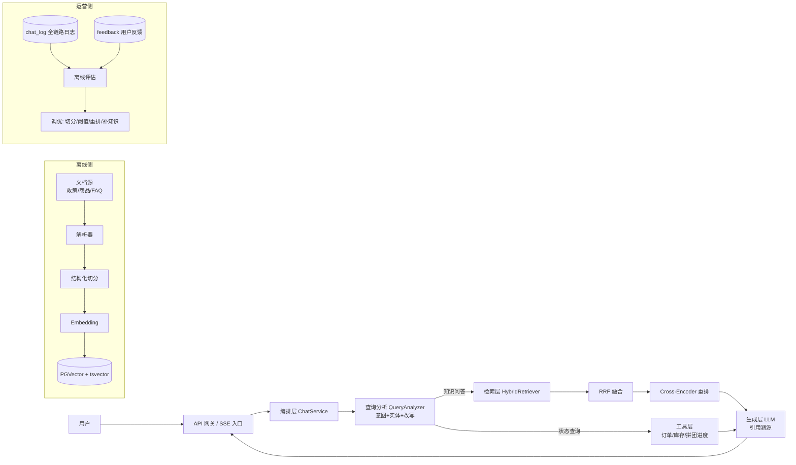

# AI 智能客服 · 深度 RAG 方案（v2.1）

> 版本：v2.1（2026-08-07）
> 范围：退款 / 商品信息 / 拼团规则三类客服问答
> 定位：生产级 RAG 方案，不做 Demo。核心差异在于 **语料治理、混合检索、重排、评估与数据飞轮** 四个环节。
> **已确认决策（2026-08-07）**：
> 1. 会话形态：首版**单轮问答**，无多轮上下文；sessionId 仅用于日志关联；
> 2. 模型：**云端 API**（DashScope / OpenAI 兼容），Embedding 与重排走云端；
> 3. 知识语料：暂无真实语料，已生成**模拟语料**（`knowledge/` 目录，含 front matter 元数据），Phase 1 先用模拟语料验证，上线前替换为真实语料；
> 4. 转人工：返回固定文案 **“人工处理中...”**，不创建工单、不接客服系统。
> 5. 其余模糊点：已按设计默认值拍板（见第 14 节 决策记录 v2.2）

---

## 0. 结论先行

1. **客服问答 = 静态知识 + 动态数据。** 退款政策、商品参数、拼团规则是“静态知识”，用 RAG；订单状态、退款进度、库存、价格、拼团进度是“动态数据”，用工具调用（SQL / 服务），RAG 检索不到也回答不了。生产级方案必须在架构上把两者分开，再用“查询分析”统一编排。
2. **深度 RAG ≠ 调一个向量库。** 向量检索只是召回的一路。完整链路是：
   `查询分析 → 查询改写 → 多路召回(向量+BM25) → RRF 融合 → Cross-Encoder 重排 → 组装生成 → 引用溯源 → 反馈/评估闭环`
3. **评估先行。** 没有 Golden 测试集和离线指标，任何“优化”都是拍脑袋。评估体系是生产级 RAG 的分水岭。
4. **兜底与降级要设计成一条链。** LLM 挂了、向量库挂了、检索为空，各有各的降级策略，最终兜底是返回“人工处理中...”。

---

## 1. 场景分析与问题边界

| 问题类型 | 例子 | 数据性质 | 处理方式 |
|---|---|---|---|
| 退款-规则 | “退款多久到账？” | 静态知识 | RAG |
| 退款-状态 | “我的订单怎么还没退款？” | 动态数据 | 工具 + 权限校验 |
| 商品-属性 | “这款支持多少瓦快充？” | 静态知识 | RAG |
| 商品-动态 | “这款还有货吗？现在多少钱？” | 动态数据 | 工具 |
| 拼团-规则 | “拼团失败会退款吗？” | 静态知识 | RAG |
| 拼团-进度 | “我还差几个人成团？” | 动态数据 | 工具 |
| 未知/投诉 | “我要投诉你们！” | 无知识可答 | 返回“人工处理中...” |

**判断原则：答案在“文档里”→ RAG；答案在“数据库里”→ 工具；两者都没有 → 返回“人工处理中...”。**

这一条要先想清楚：如果只做 RAG，用户问“我的订单到哪一步了”必然答错，客服系统会显得很蠢。

---

## 2. 总体架构



---

## 3. 知识加工管线（决定检索上限）

检索的上限由“库里的 chunk 切得好不好”决定，模型只是逼近这个上限。

### 3.1 语料规划

```
knowledge/
├── refund/        # 退款政策（条款式文档，保留条款编号）
├── product/       # 商品信息（参数表 + 商品详情文档）
├── groupon/       # 拼团规则（规则 + 活动说明）
└── faq/           # 高频问答（一问一答）
```

三类语料分开目录、分开 `category`，方便检索时按意图 pre-filter。

> 当前仓库已提供**模拟语料**（`knowledge/` 目录，含 front matter 元数据），可直接用于 Phase 1 入库验证；上线前替换为业务真实语料。Golden 测试集见 `docs/ai-eval/golden-qa.md`。

### 3.2 解析

- MD / TXT：直接解析，同时提取标题树（`#`/`##`/`###`）与 front matter 元数据；
- PDF / Word：PDFBox / Tika 抽取，**表格转 Markdown 表格**（不能丢列结构）；
- Excel 参数表：按 sheet 转成 Markdown 表，或每行转成一句自然语言（`“iPhone 15 快充功率 27W”`），后者对检索更友好。

### 3.3 结构化切分（关键：不是统一 chunkSize=500）

| 文档类型 | 切分策略 | 说明 |
|---|---|---|
| 政策文档 | 按 Markdown 标题树切分 | 每个叶子 section 一个 chunk，父标题路径写入 `metadata.section_path`，条款编号保留在正文 |
| FAQ | 一问一答 = 一个 chunk | **绝不拆开**，拆开就丢语义 |
| 商品参数表 | 一行一属性（或语义块） | 表头信息拼进每行，转自然语言句子 |
| 长正文 | 递归字符切分 | 中文分隔符优先级：`\n\n` → `\n` → `。！？；` → `，` → 空格 → 字符；chunk 400–600 token，overlap 50–100 |

每个 chunk 建议带“上下文前缀”（父标题摘要），避免孤立的碎片。

### 3.4 元数据设计（检索过滤与引用的基石）

每个 chunk 的 `metadata`（JSONB）：

```json
{
  "category": "REFUND | PRODUCT | GROUPON | FAQ",
  "doc_type": "POLICY | PARAM_TABLE | PRODUCT_DETAIL | RULE | FAQ",
  "doc_id": 123,
  "doc_version": "2026-07",
  "title": "退款规则",
  "section_path": "退款规则 > 到账时间",
  "effective_date": "2026-07-01",
  "expire_date": null,
  "product_id": 10001,
  "tags": ["退款", "到账"],
  "source_url": "https://...",
  "updated_at": "2026-08-01"
}
```

用途：召回前过滤（pre-filter）、引用展示、时效过滤、审计。

### 3.5 版本与时效

- 政策会改版。`effective_date` / `expire_date` 必须一开始就设计，检索时过滤 `effective_date <= now < expire_date`。
- 更新流程：新版本入库 → 旧版本置为过期 → 增量重索引。避免“旧政策还在回答用户”。

---

## 4. 索引设计

| 通道 | 技术 | 说明 |
|---|---|---|
| 稠密向量 | PGVector（或 ES dense_vector） | 语义召回，如“退货”↔“退款” |
| 稀疏全文 | PostgreSQL tsvector（BM25） | 精确召回，如 SKU、型号、“第三条” |
| 元数据 | JSONB + GIN 索引 | 分类/版本/时效过滤 |

- **Embedding 模型（中文场景，云端）**：DashScope `text-embedding-v3`（OpenAI 兼容）或 BGE 系列云端服务。
- 中文全文检索注意：PG `tsvector` 默认分词对中文不友好，需要 `zhparser` 插件或自定义分词配置；如果不想折腾，直接用项目已有的 **Elasticsearch 做 BM25**（`docs/dev-ops` 已有 ELK 部署），PGVector 只做向量。
- 建议索引：`hnsw (embedding vector_cosine_ops)` + `GIN (tsvector)` + `GIN (metadata)`。

### 表结构草案

```sql
CREATE EXTENSION IF NOT EXISTS vector;

CREATE TABLE ai_knowledge_doc (
  id              BIGSERIAL PRIMARY KEY,
  doc_type        VARCHAR(32) NOT NULL,   -- REFUND_POLICY / PRODUCT / GROUPON_RULE / FAQ
  title           VARCHAR(255) NOT NULL,
  source_url      VARCHAR(512),
  doc_version     VARCHAR(32),
  effective_date  DATE,
  expire_date     DATE,
  metadata        JSONB,
  created_at      TIMESTAMP DEFAULT now(),
  updated_at      TIMESTAMP DEFAULT now()
);

CREATE TABLE ai_knowledge_chunk (
  id          BIGSERIAL PRIMARY KEY,
  doc_id      BIGINT NOT NULL REFERENCES ai_knowledge_doc(id) ON DELETE CASCADE,
  chunk_index INT NOT NULL,
  chunk_text  TEXT NOT NULL,
  section_path TEXT,
  embedding   vector(1024),               -- 按实际模型维度
  metadata    JSONB,
  created_at  TIMESTAMP DEFAULT now(),
  UNIQUE (doc_id, chunk_index)
);

CREATE INDEX idx_chunk_embedding ON ai_knowledge_chunk USING hnsw (embedding vector_cosine_ops);
CREATE INDEX idx_chunk_metadata ON ai_knowledge_chunk USING gin (metadata);
-- 全文索引（需 zhparser 或使用 ES）
-- CREATE INDEX idx_chunk_tsv ON ai_knowledge_chunk USING gin (to_tsvector('chinese', chunk_text));
```

---

## 5. 在线检索链路（核心）

### 5.1 查询分析 QueryAnalyzer

一次 LLM 调用（可用小模型降低成本），结构化输出：

```json
{
  "intent": "REFUND | PRODUCT | GROUPON | OTHER",
  "need_tool": false,
  "entities": { "product_id": 10001, "order_id": "202608071234", "sku": "iPhone15-256-B" },
  "rewritten_query": "退款一般多久到账",
  "category_filter": "REFUND"
}
```

作用：
- `intent` → 决定检索范围（category pre-filter）+ 定制 system prompt；
- `entities` → 工具调用参数、metadata 过滤；
- `rewritten_query` → 口语转书面、补全省略（“退款多久”→“退款到账时间”）；
- 闲聊/低置信/投诉 → 直接返回“人工处理中...”，不浪费检索成本。

### 5.2 混合召回 + RRF 融合

- 向量检索 Top-20（相似度阈值按实测定，初始 0.5–0.6）；
- BM25 检索 Top-20；
- **RRF 融合**（分数不可比，直接用排名融合，优于 score 加权）：

```
score(d) = Σ  1 / (60 + rank_i(d))
```

- 融合后取 Top-10 进入重排。

### 5.3 Cross-Encoder 重排

- 候选只有 10 条，重排成本可控，**必须做**；
- 模型：云端 bge-reranker-v2-m3（与 BGE-M3 同源效果好）或云端 rerank 服务；
- 重排取 Top-5，分数写入日志，作为调优依据。

### 5.4 检索兜底链路（按顺序）

1. 带 category 过滤召回 → 分数不足；
2. 放宽 category 全库召回；
3. 仅 BM25 召回；
4. FAQ 表精确命中（Redis 缓存的高频问答）；
5. 仍未命中 → 返回“人工处理中...”，并记录未命中样本。

### 5.5 缓存与成本

- FAQ 类问题：query 归一化 → 哈希 → Redis 缓存，热门问题直接返回模板，LLM 调用成本趋近 0；
- 相同/相似问题（同一用户 5 分钟内）直接复用答案。

---

## 6. 生成层：控制幻觉 + 可解释

### 6.1 Prompt 组装

- system：客服角色；**只允许基于检索内容回答**；引用标注 `[1]`…`[n]`；检索不到就说不知道并转人工；涉及金额、地址等敏感信息时提示人工核实。
- context：Top-5 chunk（含标题、section_path、正文），按 token 预算截断，优先保留重排分高的。
- 输出结构化 JSON：

```json
{
  "answer": "您的订单已进入退款审核，一般 1-3 个工作日到账 [1]。",
  "references": [ { "chunk_id": 88, "title": "退款规则", "url": "https://..." } ],
  "need_human": false,
  "confidence": 0.92
}
```

### 6.2 引用溯源

- 前端展示“来源文档”，点击可看原文——既是合规要求，也是用户信任的来源。
- `references` 全链路日志记录，便于评估。

### 6.3 降级链

| 故障 | 降级策略 |
|---|---|
| LLM 超时/失败 | FAQ 模板 → 返回“人工处理中...” |
| 向量库不可用 | 仅 BM25 |
| 检索为空/低分 | 返回“人工处理中...” |
| 重排失败 | 用 RRF 融合结果直接回答 |

---

## 7. RAG × 工具协同（客服的关键体验）

状态类问题必须“规则 + 实时数据”一起回答，体验才成立：

> 用户：“我的订单 202608071234 退款到哪一步了？”
> 工具层返回：订单状态=退款审核中；
> RAG 返回：退款政策=审核通过后 1-3 个工作日到账；
> 回答：“您订单 202608071234 正在退款审核，审核通过后一般 1-3 个工作日到账 [1]。”

- 工具：`OrderQueryTool`（订单/退款状态）、`ProductQueryTool`（库存/价格）、`GrouponProgressTool`（成团进度）；
- 工具结果作为“动态上下文”与 RAG 静态知识一起进入生成 prompt；
- **权限**：工具调用前校验 userId 与订单/拼团资源归属，防止越权查询；
- 首版若工具未接入，状态类问题统一返回“人工处理中...”。

---

## 8. 评估与数据飞轮（不做 = Demo）

### 8.1 离线评估（上线前必须有基线）

- **Golden 测试集**：从真实客服会话抽样 300+ 条（当前先用模拟 30 条，`docs/ai-eval/golden-qa.md`），专家标注 `{question, expected_chunks, reference_answer, category}`；
- **检索指标**：Recall@5 / Recall@10、MRR、NDCG@10、Top-5 命中率（目标 ≥ 80%，模拟集先跑基线）；
- **生成指标**：Faithfulness（忠实度，LLM-as-judge + 人工抽样）、Answer Relevancy、引用覆盖率、转人工率；
- 每次改动（切分策略/阈值/模型/重排）跑回归，用指标说话。

### 8.2 在线反馈闭环

- 用户点赞/点踩、转人工、无效回答标记 → `ai_feedback` 表；
- 负面样本自动进“待优化队列” → 每周聚类分析 → 补知识 / 调切分 / 调阈值 / 调 prompt。

### 8.3 可观测性

`ai_chat_log` 记录每个请求的**全链路**：

```
userId, question, rewritten_query, intent, entities,
retrieved_chunks[{chunk_id, score_rank}], rerank_scores,
answer, references, need_human, latency_ms, tokens, degraded_level
```

监控指标：检索耗时 P95、首 token 延迟、转人工率、点踩率、平均满意度。

---

## 9. 技术选型与模块设计

### 9.1 选型

| 组件 | 推荐 | 理由 |
|---|---|---|
| 语言/框架 | Java 17 + Spring Boot 2.7（现有） | 与项目同生态 |
| LLM | DashScope qwen（OpenAI 兼容） | 云端 API，已确认 |
| RAG 编排 | **自研编排层**（可用 Spring AI 只做 LLM/Embedding 客户端） | 现成 `QuestionAnswerAdvisor` 只是单路 Top-K 向量检索，撑不起混合召回+重排+评估 |
| Embedding | DashScope text-embedding-v3（云端） | 中文场景 |
| 重排 | 云端 bge-reranker-v2-m3 | 同源效果好 |
| 向量库 | PGVector | 项目已有 PostgreSQL |
| 全文 | PG tsvector（需 zhparser）或 Elasticsearch（已有 ELK） | 中文分词选型时二选一 |
| 缓存 | Redis（已有） | FAQ 直出、检索缓存 |

### 9.2 模块划分（沿用 DDD）

```
group-buy-market-xk-ai-api           # 接口与 DTO
  IAiChatService / IAiFeedbackService / IAiEvaluationService

group-buy-market-xk-ai-domain        # 领域模型
  QueryPlan / ScoredChunk / ChatAnswer / KnowledgeDoc / KnowledgeChunk
  KnowledgeIngestionService / QueryAnalyzer / HybridRetriever / Reranker / ChatService

group-buy-market-xk-ai-infrastructure # 适配层
  parser/（PDF/Word/MD/Excel）
  splitter/（结构化切分器）
  embedding/（云端 API）
  repository/（PGVector + tsvector + metadata 过滤）
  rerank/（云端）
  llm/（OpenAI 兼容 client）
  tool/（订单/库存/拼团进度工具）

group-buy-market-xk-ai-trigger       # HTTP 入口
  AIChatController（单轮问答，SSE 流式可选）
  FeedbackController
  IngestionController（管理员触发入库/重索引）
```

### 9.3 关键接口

```java
public interface KnowledgeIngestionService {
    void ingest(DocumentSource source);          // 解析→结构化切分→embedding→入库
    void deactivateVersion(String category, String version);
    void reindexAll();
}

public interface QueryAnalyzer {
    QueryPlan analyze(String userId, String question);   // 单轮，无历史
}

public interface HybridRetriever {
    List<ScoredChunk> retrieve(QueryPlan plan, int topK);   // 向量 + BM25 + RRF
}

public interface Reranker {
    List<ScoredChunk> rerank(String query, List<ScoredChunk> candidates, int topK);
}

public interface ChatService {
    ChatResponse chat(String userId, String question, String sessionId);   // 单轮
}
```

---

## 10. 分阶段落地计划

| 阶段      | 内容                                                      | 周期    | 验收标准                   |
| ------- | ------------------------------------------------------- | ----- | ---------------------- |
| Phase 0 | 语料盘点（模拟语料已就绪）、Golden 测试集（已生成 30 条）、embedding/重排选型验证（云端） | 3–5 天 | 检索基线可跑                 |
| Phase 1 | 知识入库管线 + 混合检索(RRF) + 最小问答接口 + 离线评估                      | 2 周   | Top-5 命中率 ≥ 60%，链路通    |
| Phase 2 | 查询分析(意图+实体+改写) + Cross-Encoder 重排 + 引用溯源 + 反馈收集 + 全链路日志 | 2 周   | Top-5 命中率 ≥ 80%，转人工率下降 |
| Phase 3 | 工具调用(订单/库存/拼团进度) + 未命中聚类 + 自动化评估回归（多轮澄清顺延二期）            | 2 周   | 状态类问题可答，评估可一键回归        |
| Phase 4 | 持续优化：A/B 切分/阈值、知识更新流程、成本优化（FAQ 缓存、模型路由）                 | 持续    | 满意度提升、成本可控             |

**建议先做 Phase 0 + 1**：先有 Golden 集和检索基线，后面每一步优化都有依据。

---

## 11. 关键风险与对策

| 风险 | 对策 |
|---|---|
| 中文分词（PG tsvector） | 用 zhparser，或直接用已有 Elasticsearch 做 BM25 |
| 切分不合理导致召回差 | Golden 集评估驱动，结构化切分 + 分类型切分策略 |
| 政策时效错误回答 | 元数据版本化 + 时效过滤 + 新版本入库流程 |
| 幻觉（编造退款条款） | 强约束 prompt + 引用溯源 + Faithfulness 评估 |
| 成本失控 | FAQ 缓存直出、检索缓存、小模型路由、批量 embedding |
| 越权查询他人订单 | 工具调用前 userId 与资源归属校验 |
| 云端 API 不可用 | 降级链（FAQ 模板 → 人工处理中） |

---

## 12. 一句话总结

**先把“知识 vs 数据”分清楚，再把“切分 → 混合召回 → RRF → 重排 → 生成 → 引用 → 评估”这条链做扎实，最后用反馈和指标把链路养起来——这就是一个能上线、能迭代、能讲得清深度的客服 RAG 系统。**

---

## 13. 待澄清需求清单（更新至 v2.1）

> P0 已确认 4 项；剩余 P0（商品数据源）与 P1/P2 待拍板。已确认项直接进入设计，不再等待。

### P0 阻断性模糊点

| #   | 模糊点     | 状态        | 结论                                                         |
| --- | ------- | --------- | ---------------------------------------------------------- |
| 1   | 会话形态    | ✅ 已确认     | 首版单轮问答，无多轮上下文；sessionId 仅用于日志关联                            |
| 2   | 模型部署环境  | ✅ 已确认     | 云端 API（DashScope / OpenAI 兼容），Embedding / 重排走云端            |
| 3   | 知识语料现状  | ✅ 已确认（模拟） | 暂无真实语料，已生成模拟语料 `knowledge/`；Phase 1 先用模拟语料验证，上线前替换为真实语料    |
| 4   | 商品信息数据源 | ⏳ 待确认     | 参数来自 DB 还是文档？SKU 量级？价格/库存是否实时查？建议：参数 DB 为主、文档为辅，价格/库存走实时工具 |
| 5   | 转人工的边界  | ✅ 已确认     | 返回固定文案“人工处理中...”，不创建工单、不接客服系统                              |

### P1 影响迭代质量的模糊点

| #   | 模糊点        | 需要澄清                                           | 建议默认值                                                    |
| --- | ---------- | ---------------------------------------------- | -------------------------------------------------------- |
| 6   | 业务规则口径     | 退款/拼团具体规则（哪些场景可退、时效、手续费、优惠券退回、成团条件）需要业务方给出权威版本 | 先用 `knowledge/` 模拟口径搭建，真实口径确认后替换                         |
| 7   | 命中率怎么算     | “Top-5 命中率 ≥ 80%”的“命中”如何判定                     | Golden 集每条标注 expected_doc/expected_section，覆盖任一即算命中      |
| 8   | Golden 集来源 | 谁能提供真实客服会话？谁负责标注？                              | 已生成 30 条模拟 Golden（`docs/ai-eval/golden-qa.md`），真实会话到位后扩充 |
| 9   | 动态工具范围与权限  | 首版接哪几个工具？userId 从哪来？订单归属如何校验？                  | 首版接“订单/退款状态”1 个，其余二期；userId 从登录态取                        |
| 10  | 反馈采集       | 首版前端是否有“有帮助/无帮助”和转人工按钮                         | 建议首版就做，否则没有优化依据                                          |
| 11  | 政策更新流程     | 谁触发更新、是否审核、变更后多久生效                             | 首版管理员跑脚本/API，二期管理后台                                      |
| 12  | 响应时间目标     | 端到端和首 token 延迟目标？是否 SSE 流式                     | 端到端 <3s（95%）、首 token <1.5s、SSE 流式                        |

### P2 可后置的模糊点

| #   | 模糊点   | 需要澄清                                                                        |
| --- | ----- | --------------------------------------------------------------------------- |
| 13  | 多语言   | 只中文，还是需要英文/其他语言？（默认仅中文）                                                     |
| 14  | 回答风格  | 语气、是否允许外链、是否 Markdown 富文本展示                                                 |
| 15  | 成本上限  | 单次问答成本上限、月预算、FAQ 缓存命中率目标                                                    |
| 16  | 合规与留档 | 聊天记录保存多久？是否脱敏、审计、导出                                                         |
| 17  | 评估自动化 | 每周人工跑评估，还是 CI 自动回归；LLM-as-judge 用哪个模型                                       |
| 18  | 现有设施  | PostgreSQL 版本（需 12+ 且允许装 vector 扩展）？Elasticsearch 是否可用（决定 BM25 走 PG 还是 ES）？ |

---

## 14. 决策记录（v2.2）—— 剩余模糊点拍板

> 由设计侧自行决定的默认值，开发按此执行；业务侧如有不同口径，随时可改（改动影响已标注）。

| # | 模糊点 | 决策 | 影响 |
|---|---|---|---|
| 4 | 商品信息数据源 | Phase 1 以 `knowledge/product/` 文档为商品知识来源（参数表 + 商品详情）；价格/库存为动态数据，二期接实时工具；SKU 按 <1 万量级设计，参数结构化入库 | 文档入库即可跑通；DB 化只需替换 repository |
| 6 | 业务规则口径 | 先用 `knowledge/` 模拟口径搭建与验证，真实口径确认后替换文档重新入库 | 规则变更只影响语料，不影响代码 |
| 7 | 命中率定义 | Golden 每条标注 `expected_doc` + `expected_section`，检索 Top-5 中任意一条 chunk 的 doc/section 与标注匹配即算命中；指标：Top-5 命中率、Recall@5 | 评估脚本按此实现 |
| 8 | Golden 集来源 | 先用模拟 30 条（`docs/ai-eval/golden-qa.md`）建基线；真实会话到位后由业务+标注人扩充，标注标准沿用现有表结构 | 评估接口支持随时换数据集 |
| 9 | 动态工具范围与权限 | Phase 1-2 不接工具，状态类问题（含订单号/拼团进度）统一返回“人工处理中...”；Phase 3 接订单/退款状态工具；userId 从登录态 JWT 获取，归属校验 = 订单 user_id == 当前 userId | 首版接口预留 userId 字段 |
| 10 | 反馈采集 | 首版就做：chat 响应返回 `messageId`，前端点赞/点踩/转人工上报到 `ai_feedback` 表 | 增加一张表 + 一个上报接口 |
| 11 | 政策更新流程 | 首版管理员通过 `POST /api/ai/admin/ingest` 触发全量/增量重索引，`deactivateVersion` API 下线旧版本；二期再做管理后台 | 仅 admin 接口，不做 UI |
| 12 | 响应时间目标 | 端到端 <3s（95%）；首版返回 JSON（非流式），SSE 流式二期再做 | 接口契约简单稳定 |
| 13 | 多语言 | 仅中文 | 语料与 prompt 均为中文 |
| 14 | 回答风格 | 简洁、口语化中文；仅展示知识来源引用，不带外链；支持 Markdown 渲染 | prompt 固定模板 |
| 15 | 成本上限 | 单次问答 LLM 调用 ≤1 次（不引入多步）；FAQ 类问题走 Redis 缓存直出；月度成本由监控观察，无硬性上限 | 检索缓存 + FAQ 直出 |
| 16 | 合规与留档 | `ai_chat_log` 保留 180 天；手机号/地址等敏感信息脱敏后落库；日志仅供内部审计 | 日志表加脱敏字段 |
| 17 | 评估自动化 | 每周人工跑一次离线评估；配置/代码变更时通过 admin 接口手动触发回归；LLM-as-judge 用 qwen-max（二期接入，首版以检索指标为准） | admin 评估接口 |
| 18 | 现有设施 | PostgreSQL 12+ 且启用 `vector` 扩展；BM25 首版走 PG `tsvector`（中文用 `zhparser`，若环境装不上则降级 ES 或改为按关键词 LIKE/前缀召回）；不新增 ES 依赖 | DDL 提供 zhparser 可选脚本 |

**Phase 1 验收口径（据此开发）**：
- 检索：Top-5 命中率 ≥ 60%（模拟 Golden 30 条基线）、Recall@5 ≥ 0.6；
- 问答：知识类问题返回带引用的答案；无命中/状态类/投诉类返回“人工处理中...”；单次请求 LLM 调用 ≤1 次；
- 工程：`group-buy-market-xk-ai` 模块可编译，DDL 可执行，接口契约稳定。